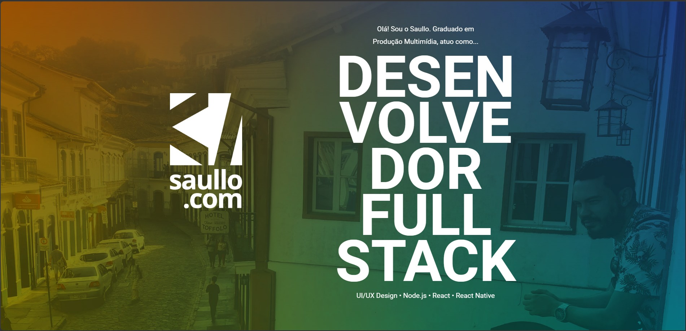

# saullo.com

Site pessoal e portfólio de **Saullo Bueno**, desenvolvedor Full Stack (UI/UX Design · Node.js · React · React Native). É uma página única (SPA) que conta minha trajetória, minha expertise técnica e reúne os projetos que já entreguei.



## O que tem no site

- **Minha trajetória**: origem, formação em Produção Multimídia (2012) e a evolução do design gráfico e front-end para a engenharia de software Full Stack.
- **Expertise técnica**: design e UI/UX, front-end, back-end, mobile, qualidade e CI/CD, arquitetura e performance.
- **O que faço**: visão do ciclo completo de um produto digital, da concepção visual ao desenvolvimento.
- **Portfólio**:
  - **Projetos em destaque**: aplicações full stack com IA publicadas e com código aberto (Forge, FieldOps, Nexus Developer Platform, Product Analytics OS, AI Customer Operations Platform, Command Center e AI Workflow Studio). Cada card traz descrição, destaques, stack, links para o GitHub e a demo ao vivo, além de uma galeria de screenshots reais com miniaturas e lightbox com zoom.
  - **Trabalhos anteriores**: sites e identidades criados para clientes, exibidos em lightbox, com opção de "ver mais".
- **Contato**: e-mail, LinkedIn, WhatsApp e GitHub.

## Tecnologias

React 19 · TypeScript · Vite · styled-components · React Router · react-icons · [yet-another-react-lightbox](https://yet-another-react-lightbox.com/) · Axios

## Como rodar

```bash
npm install
npm run dev       # servidor de desenvolvimento
npm run build     # typecheck + build de produção em dist/
npm run preview   # serve o build localmente
npm run lint      # ESLint
```

## Estrutura

```
public/                     Arquivos estáticos (favicon, screenshot, imagens dos trabalhos anteriores)
src/
  assets/                   Imagens do site
    portfolio/<projeto>/    Screenshots de cada projeto em destaque
  components/               Header, Footer, Section, Modal e ProjectGallery
  data/
    featuredProjects.ts     Projetos em destaque (veja abaixo)
    portfolio.json          Trabalhos anteriores (sites de clientes)
  views/home.tsx            Página única, com todas as seções
  routes/                   Configuração de rotas
  styles/                   Estilos globais
```

## Como adicionar um projeto em destaque

Os projetos em destaque ficam em `src/data/featuredProjects.ts`, um arquivo TypeScript com a lista `featuredProjects` e a interface `FeaturedProject`. Ele foi criado junto com a reformulação da seção de portfólio (commit `8e7cd08`) e é lido diretamente por `src/views/home.tsx`: não é gerado automaticamente nem vem de nenhuma biblioteca.

Para incluir um novo projeto:

1. Coloque os screenshots em `src/assets/portfolio/<slug-do-projeto>/`.
2. Importe as imagens no topo de `featuredProjects.ts`.
3. Adicione um objeto à lista `featuredProjects` com `slug`, `title`, `subtitle`, `description`, `highlights`, `stack`, `githubUrl`, `demoUrl` (opcional) e `images`.

A ordem da lista é a ordem exibida no site.
